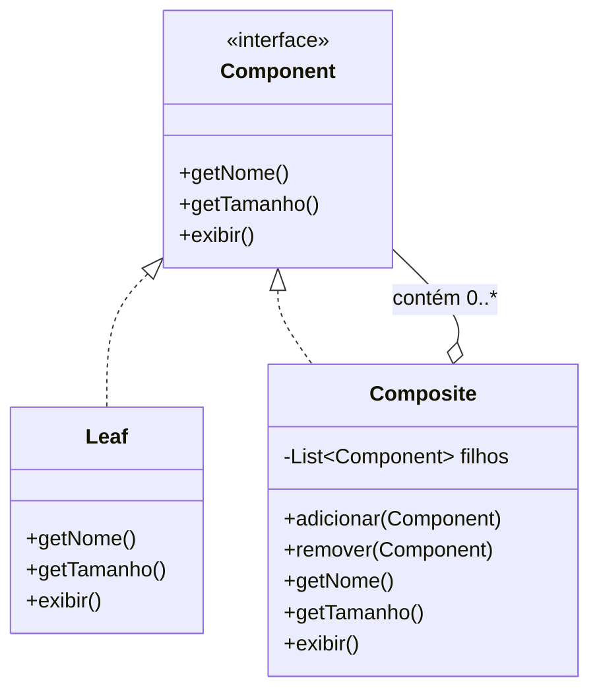

# Padrão Composite (Composite Pattern)

**Disciplina:** Engenharia de Software II
**Categoria:** Padrão Estrutural (Structural Pattern) — GoF

## 1. Intenção

O Composite permite compor objetos em estruturas de árvore para representar
hierarquias do tipo *"parte-todo"* (part-whole). Ele permite que clientes
tratem objetos individuais (folhas) e composições de objetos (compostos) de
**forma uniforme**, através de uma interface comum.

Em outras palavras: se você tem uma estrutura recursiva — uma pasta que
contém arquivos e outras pastas, um componente de UI que contém outros
componentes, um item de pedido que pode ser um produto único ou um combo de
produtos — o Composite evita que o código cliente precise saber, a cada
momento, "isto é uma folha ou um composto?".

## 2. Problema que ele resolve

Estruturas hierárquicas recursivas (árvores) são comuns: sistemas de
arquivos, menus, estruturas organizacionais, árvores de componentes
gráficos. Sem um padrão, o código tende a:

- Ter classes separadas para "item simples" e "container de itens", com
  listas distintas para cada tipo de filho;
- Duplicar lógica de percurso (loops que somam, imprimem, calculam) em cada
  operação;
- Usar `instanceof` e casts para decidir como tratar cada elemento;
- Ficar difícil de estender: cada novo tipo de "folha" exige alterar as
  classes de container existentes.

## 3. Estrutura (UML)



## 4. Participantes

| Papel GoF | No nosso exemplo |
|---|---|
| **Component** | `ComponenteArquivo` (interface comum) |
| **Leaf** | `Arquivo` (não tem filhos) |
| **Composite** | `Pasta` (contém uma lista de `ComponenteArquivo`, podendo misturar arquivos e outras pastas) |
| **Client** | `Main`, que manipula tudo via `ComponenteArquivo`, sem saber se é um arquivo ou uma pasta |

## 5. Exemplo escolhido: Sistema de Arquivos

Escolhemos modelar **Arquivos** e **Pastas**, pois é o exemplo clássico de
hierarquia parte-todo: uma pasta pode conter arquivos e/ou outras pastas,
recursivamente, e em algum momento queremos operações comuns como "calcular
tamanho total" e "exibir a árvore".

## 6. Sem o padrão (`sem-padrao/`)

Em `Pasta`, mantemos **duas listas separadas** (`List<Arquivo>` e
`List<Pasta>`), porque não existe uma abstração comum entre os dois tipos.
Isso obriga:

- `calcularTamanhoTotal()` a percorrer as duas listas separadamente;
- `exibir()` a repetir a mesma lógica de percurso;
- Qualquer novo tipo de "item" (ex.: um `LinkSimbolico`) a exigir uma
  **terceira lista** e a duplicação de código em todos os métodos de
  `Pasta`.

Ou seja: a classe `Pasta` cresce e se torna frágil a cada novo tipo de
conteúdo — um sintoma claro de violação do **Princípio Aberto/Fechado
(OCP)**.

## 7. Com o padrão (`com-padrao/`)

Criamos a interface `ComponenteArquivo`, implementada tanto por `Arquivo`
(leaf) quanto por `Pasta` (composite). `Pasta` mantém **uma única lista**
de `ComponenteArquivo` e delega a cada filho a responsabilidade de saber
calcular seu próprio tamanho e se exibir — `Pasta` não precisa saber se o
filho é um `Arquivo` ou outra `Pasta`.

Resultado:

- Um único laço, em um único lugar, resolve tanto o cálculo de tamanho
  quanto a exibição;
- Adicionar um novo tipo de componente (ex.: `LinkSimbolico`) significa só
  criar uma nova classe que implementa `ComponenteArquivo` — **nenhuma
  classe existente precisa ser alterada**;
- O cliente (`Main`) manipula a árvore inteira de forma uniforme.

## 8. Comparativo

| Aspecto | Sem Composite | Com Composite |
|---|---|---|
| Nº de listas em `Pasta` | Uma por tipo de filho | Uma só (tipo da interface) |
| Adicionar novo tipo de item | Altera `Pasta` em vários métodos | Cria nova classe, zero alteração em código existente |
| Uso de `instanceof`/casts | Tende a aumentar | Não é necessário |
| Tratamento do cliente | Precisa diferenciar arquivo de pasta | Trata tudo como `ComponenteArquivo` |
| Aderência a princípios SOLID | Viola OCP | Respeita OCP |
| Complexidade da interface comum | Não existe | Precisa ser bem desenhada (ver pontos fracos) |

## 9. Pontos fortes

- **Uniformidade**: cliente trata objetos simples e composições da mesma
  forma, simplificando bastante o código de quem consome a estrutura.
- **Extensibilidade (OCP)**: novos tipos de componente são adicionados sem
  tocar no código existente.
- **Recursão natural**: operações sobre a árvore (somar, imprimir,
  validar) ficam triviais de implementar recursivamente.
- **Facilita a composição dinâmica**: árvores podem ser montadas e
  alteradas em tempo de execução.

## 10. Pontos fracos

- **Pode tornar o design excessivamente genérico**: a interface comum
  pode acabar forçando `Leaf` a "herdar" métodos que não fazem sentido
  para ela (ex.: `adicionar()` em um `Arquivo`), quebrando, em parte, o
  Princípio da Substituição de Liskov se não for bem tratado.
- **Dificuldade de restringir tipos**: é mais difícil garantir, em tempo
  de compilação, que só certos tipos de filhos sejam permitidos dentro de
  um composto específico.
- **Pode mascarar problemas de desempenho**: operações recursivas em
  árvores muito profundas/grandes podem ter custo não evidente para quem
  usa a interface comum.
- Exige reflexão de design para decidir o que vai (ou não) para a
  interface `Component`.

## 11. Quando usar

- Quando a aplicação precisa representar hierarquias parte-todo;
- Quando se quer que clientes ignorem a diferença entre objetos simples e
  composições;
- Quando se prevê que novos tipos de "folha" ou "composto" serão
  adicionados com frequência.

## 12. Conclusões do grupo

O estudo do padrão Composite mostrou como ele simplifica a modelagem de estruturas hierárquicas do tipo parte-todo, permitindo que objetos individuais e composições sejam tratados de maneira uniforme. No exemplo do sistema de arquivos, foi possível observar que a utilização de uma interface comum eliminou a necessidade de manter listas separadas para cada tipo de elemento e reduziu a duplicação de código nas operações de cálculo e exibição.

Comparando as duas implementações, percebe-se que a versão com o padrão apresenta melhor organização, maior reutilização de código e maior facilidade de manutenção. Além disso, ela está mais alinhada aos princípios da orientação a objetos, especialmente ao Princípio Aberto/Fechado (Open/Closed Principle – OCP), pois novos tipos de componentes podem ser adicionados sem modificar as classes existentes.

Por outro lado, o padrão também exige um planejamento cuidadoso da interface comum, para que ela represente apenas comportamentos realmente compartilhados entre folhas e composições. Em aplicações muito simples, sua utilização pode aumentar a quantidade de classes sem trazer benefícios significativos. Entretanto, em sistemas que possuem estruturas hierárquicas complexas ou que tendem a evoluir ao longo do tempo, o Composite oferece vantagens importantes em termos de flexibilidade, extensibilidade e organização do código.

Dessa forma, conclui-se que o padrão Composite é uma solução eficiente para representar árvores de objetos e tornar o código mais limpo, reutilizável e preparado para futuras extensões, sendo uma alternativa recomendada sempre que houver a necessidade de manipular estruturas recursivas de forma uniforme.

## 13. Como executar os exemplos

```bash
# Sem o padrão
javac .\sempadrao\*.java
java sempadrao.Main

# Com o padrão
javac .\compadrao\*.java
java compadrao.Main
```

## 14. Referências

- GAMMA, E.; HELM, R.; JOHNSON, R.; VLISSIDES, J. *Design Patterns:
  Elements of Reusable Object-Oriented Software*. 1994.
- Refactoring Guru. *Composite*.
  https://refactoring.guru/pt-br/design-patterns/composite
